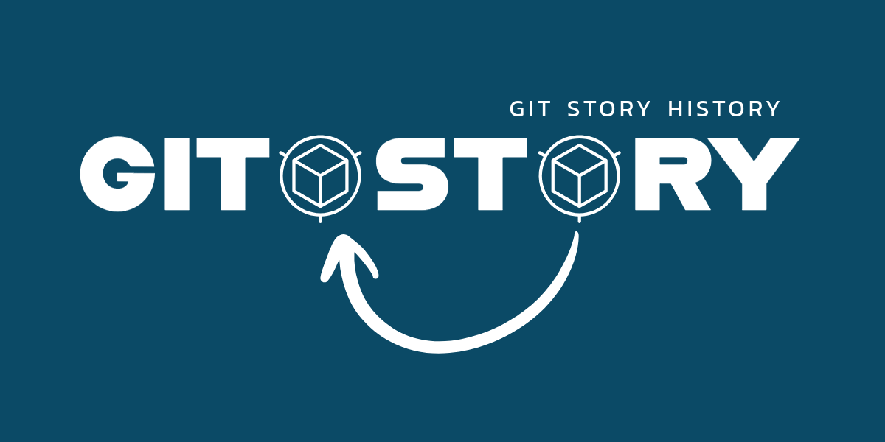
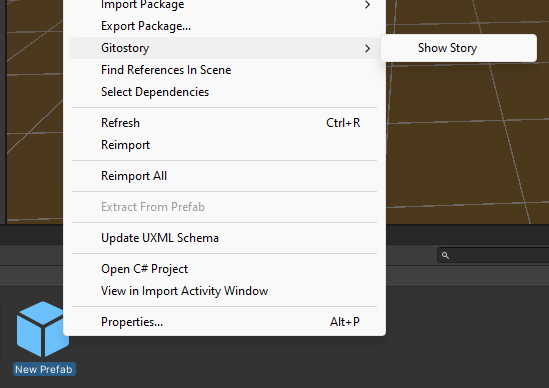
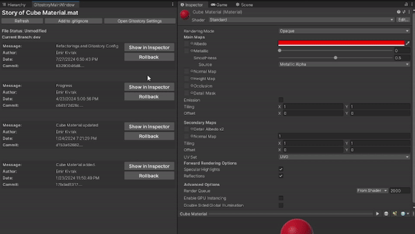
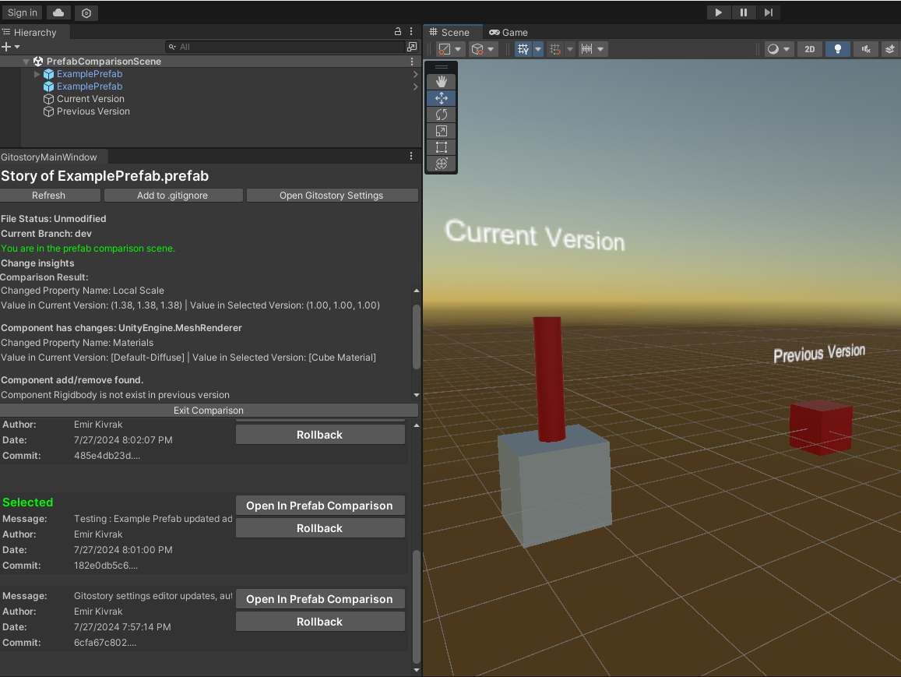

# Gitostory



## Overview

**Gitostory** is a Unity package that enables you to view and compare previous versions of your assets without altering the current state.

With Gitostory, you can:
- View the history of any asset directly within Unity.
- Compare previous versions of prefabs, scripts, and other assets without rolling back.
- Rollback to any previous version if needed.
- Gain insights and side by side comparison for prefabs.
- Get current state of file and discard current changes if you want.
- Add files to .gitignore with one click.

## Asset Store

Gitostory will soon be available as a free asset in the Version Control section of the Unity Asset Store.

## Prerequisites

- A Unity project with an initialized Git repository (`.git` folder present).
- Git installed on your system.

## Compatibility

Gitostory has been tested and works on the following platforms:
- **Windows**
- **MacOS**
- **Linux**

### Unity

Gitostory is compatible with Unity **2018.3 and later**, as these versions support the .NET Standard 2.0 API set required by LibGit2Sharp.

### Git

It is recommended to use **Git version 2.20 or later** to ensure compatibility with features and performance improvements.


## Installation

1. **Download the Package**:
    - Download latest release from releases section or clone this repo.

2. **Add to Your Project**:
    - Open your Unity project.
    - Drag and drop the Gitostory package folder into your project's `Assets` folder.

3. **Configure Gitostory If Needed**:
    - Gitostory will most likely work without any configuration. If it doesn't, please check your project's Git path.
    - Open the Gitostory settings via `Window > Gitostory > Gitostory Settings`.
    - Set the `Temporary Root Folder` and `Repository Root Folder` as needed.


### Viewing History

1. Right-click on an asset.
2. Select `Gitostory > Show Story`.



### Preview Any Asset Instantly

1. In the history window, select a commit.

 

### Comparing Prefabs 

1. In the history window, select a commit.
2. Click `Open in Prefab Comparison` or the appropriate comparison option.

 


### Rolling Back

1. In the history window, select a commit.
2. Click `Rollback`.
3. Confirm the rollback in the prompt.


## Usage From Code

Remember, Gitostory is living in editor space.

```csharp
using GitostorySpace; // import gitostory space
using System.Collections;
using System.Collections.Generic;
using UnityEngine;

/// <summary>
/// This method is an example of how to use Gitostory from code.
/// </summary>
public class GitostoryUsageFromCodeExample 
{
   public static void Test(string filePath)
    {
        Gitostory gitostory = new Gitostory(); // create a instance

        // Use operations like getting status
        bool isFileModified = gitostory.IsFileModified(filePath); 

        // Get working branch
        string branchName = gitostory.GetCurrentBranchName();

        // Get all past commits where this file changed.
        List<GitostoryPastCommitData> allCommitsForFile = gitostory.GetAllCommits(filePath);
        foreach (var commit in allCommitsForFile)
        {
            Debug.Log("Commit Hash: " + commit.CommitHash);
            Debug.Log("Commit Message: " + commit.CommitMessage);
            Debug.Log("Commit Date: " + commit.CommitDate);
            Debug.Log("Commit Author: " + commit.Author);
        }
    }
}
```


## Contributing

All pull requests makes this package better will be reviewed and accepted.

## License

This project is licensed under the MIT License. See the [LICENSE](LICENSE) file for details.

## Support

For support and questions, just open a ticket.


## Dependencies

Gitostory is using [LibGit2Sharp](https://github.com/libgit2/libgit2sharp) library to provide Git functionalities within the Unity Editor. I'm grateful for the contributions of the LibGit2Sharp community. **LibGit2Sharp is used as-is**.

